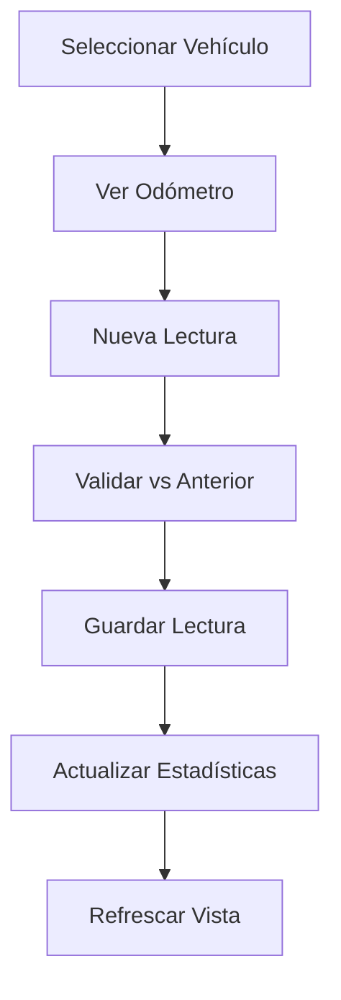

# Sistema de Gestión de Flota - DriverPro

## 📋 Descripción General

El Sistema de Gestión de Flota es una solución completa e integral para la administración de vehículos, tarjetas de recarga y catálogos vehiculares. Desarrollado con React, hooks optimizados y un diseño modular que garantiza escalabilidad y mantenibilidad.

## 🏗️ Arquitectura del Sistema

### Estructura de Archivos

```
src/
├── api/
│   ├── vehicles.js              # API para vehículos, marcas, tipos y modelos
│   └── fleet-management.js      # API para odómetros y tarjetas de recarga
├── hooks/
│   ├── useVehicles.js          # Hooks para gestión de vehículos y catálogos
│   └── useFleetManagement.js   # Hooks para odómetros y tarjetas
└── components/
    └── fleet/
        ├── FleetManagement.jsx         # Componente principal
        ├── VehiclesDashboard.jsx       # Dashboard de vehículos
        ├── VehicleCard.jsx             # Tarjeta individual de vehículo
        ├── VehicleModal.jsx            # Modal para crear/editar vehículos
        ├── RechargeCardsDashboard.jsx  # Dashboard de tarjetas
        ├── RechargeCardItem.jsx        # Item individual de tarjeta
        ├── RechargeCardModal.jsx       # Modal para crear/editar tarjetas
        ├── OdometerManagement.jsx      # Gestión de odómetros
        ├── OdometerModal.jsx           # Modal para lecturas de odómetro
        ├── FleetCatalogManagement.jsx  # Gestión de catálogos
        ├── CatalogModal.jsx            # Modal para catálogos
        └── index.js                    # Exportaciones
```

## 🚀 Funcionalidades Principales

### 1. Gestión de Vehículos

- **Dashboard interactivo** con estadísticas en tiempo real
- **Filtros avanzados** por estado, condición, marca, etc.
- **Tarjetas visuales** con información detallada
- **Modal completo** para crear y editar vehículos
- **Validaciones inteligentes** en formularios

### 2. Gestión de Tarjetas de Recarga

- **Dashboard especializado** para tarjetas de combustible y peaje
- **Control de saldos** con visualización opcional por seguridad
- **Historial de movimientos** completo
- **Alertas automáticas** para saldos bajos o negativos
- **Soporte múltiples proveedores** (Parkia, RFID, otros)

### 3. Control de Odómetros

- **Registro de lecturas** con validaciones automáticas
- **Estadísticas de uso** por período
- **Historial completo** con fuente de datos
- **Alertas de incrementos** sospechosos
- **Integración** con el kilometraje del vehículo

### 4. Catálogos de Flota

- **Gestión de marcas** de vehículos
- **Tipos de vehículos** con descripciones
- **Modelos específicos** por marca y año
- **Relaciones inteligentes** entre catálogos

## 💡 Características Técnicas Destacadas

### 🔧 Hooks Optimizados

- **Caché inteligente** que evita peticiones innecesarias
- **Estados granulares** para loading, error y datos
- **Funciones memoizadas** con `useCallback` y `useMemo`
- **Refetch automático** tras operaciones CRUD

### 📊 Gestión de Estado

- **Estado local optimizado** sin Redux innecesario
- **Sincronización automática** entre componentes
- **Actualizaciones reactivas** del UI
- **Rollback automático** en caso de errores

### 🎨 UI/UX Excepcional

- **Diseño responsivo** con Tailwind CSS
- **Animaciones suaves** y micro-interacciones
- **Feedback visual** inmediato
- **Accesibilidad** incorporada

### 🛡️ Validaciones y Seguridad

- **Validación en tiempo real** de formularios
- **Sanitización** de datos de entrada
- **Manejo robusto** de errores
- **Permisos granulares** por rol

## 🔄 Flujos de Trabajo

### Flujo de Creación de Vehículo

```mermaid
graph TD
    A[Clic "Nuevo Vehículo"] --> B[Abrir Modal]
    B --> C[Cargar Catálogos]
    C --> D[Llenar Formulario]
    D --> E[Validación en Tiempo Real]
    E --> F[Enviar Datos]
    F --> G[Actualizar Lista]
    G --> H[Cerrar Modal]
```

### Flujo de Gestión de Odómetro



## 🎯 APIs y Endpoints

### Vehicles API (`src/api/vehicles.js`)

#### Marcas de Vehículos

- `vehicleBrands.getAll(options)` - Obtener todas las marcas
- `vehicleBrands.getById(id)` - Obtener marca específica
- `vehicleBrands.create(data)` - Crear nueva marca
- `vehicleBrands.update(id, data)` - Actualizar marca
- `vehicleBrands.delete(id)` - Deshabilitar marca

#### Tipos de Vehículos

- `vehicleTypes.getAll(options)` - Obtener todos los tipos
- `vehicleTypes.create(data)` - Crear nuevo tipo
- `vehicleTypes.update(id, data)` - Actualizar tipo
- `vehicleTypes.delete(id)` - Deshabilitar tipo

#### Modelos de Vehículos

- `vehicleModels.getAll(options)` - Obtener todos los modelos
- `vehicleModels.getByBrand(brandId)` - Modelos por marca
- `vehicleModels.create(data)` - Crear nuevo modelo
- `vehicleModels.update(id, data)` - Actualizar modelo

#### Vehículos

- `vehicles.getAll(options)` - Obtener todos los vehículos
- `vehicles.getByCompany(companyId)` - Vehículos por empresa
- `vehicles.getAvailable()` - Vehículos disponibles
- `vehicles.create(data)` - Crear nuevo vehículo
- `vehicles.update(id, data)` - Actualizar vehículo

### Fleet Management API (`src/api/fleet-management.js`)

#### Odómetros

- `vehicleOdometers.getByVehicle(vehicleId)` - Lecturas por vehículo
- `vehicleOdometers.getLatestByVehicle(vehicleId)` - Última lectura
- `vehicleOdometers.getVehicleStats(vehicleId)` - Estadísticas de uso
- `vehicleOdometers.create(data)` - Registrar lectura

#### Tarjetas de Recarga

- `rechargeCards.getAll(options)` - Obtener todas las tarjetas
- `rechargeCards.getByCode(code)` - Buscar por código
- `rechargeCards.create(data)` - Crear nueva tarjeta
- `rechargeCards.update(id, data)` - Actualizar tarjeta

#### Movimientos de Recarga

- `rechargeMovements.getByCard(cardId)` - Movimientos por tarjeta
- `rechargeMovements.getCardBalance(cardId)` - Balance actual
- `rechargeMovements.topupCard(cardId, amount)` - Recargar tarjeta
- `rechargeMovements.spendCard(cardId, amount)` - Registrar gasto

## 🎨 Componentes y Props

### VehicleModal

```jsx
<VehicleModal
  vehicle={selectedVehicle} // Vehículo a editar (null para nuevo)
  onClose={handleClose} // Función para cerrar modal
  onSave={handleSave} // Función tras guardar exitoso
/>
```

### OdometerManagement

```jsx
<OdometerManagement
  vehicleId={vehicleId} // ID del vehículo
  vehicle={vehicleObject} // Objeto del vehículo
/>
```

### RechargeCardItem

```jsx
<RechargeCardItem
  card={cardObject} // Objeto de la tarjeta
  onEdit={handleEdit} // Función para editar
  onDelete={handleDelete} // Función para eliminar
  onView={handleView} // Función para ver detalles
/>
```

## 🚀 Hooks Personalizados

### useVehicles

```jsx
const {
  vehicles,        // Array de vehículos
  loading,         // Estado de carga
  error,          // Error si existe
  stats,          // Estadísticas calculadas
  actions: {
    refresh,      // Recargar datos
    create,       // Crear vehículo
    update,       // Actualizar vehículo
    delete        // Eliminar vehículo
  }
} = useVehicles({ companyId, status, condition });
```

### useVehicleOdometers

```jsx
const {
  odometers, // Array de lecturas
  latest, // Última lectura
  stats, // Estadísticas de uso
  loading,
  error,
  actions: {
    refresh, // Recargar datos
    addReading, // Agregar nueva lectura
  },
} = useVehicleOdometers(vehicleId);
```

### useRechargeCards

```jsx
const {
  cards,          // Array de tarjetas
  loading,
  error,
  stats,          // Estadísticas de tarjetas
  actions: {
    refresh,
    create,
    update,
    delete
  }
} = useRechargeCards({ companyId, status });
```

## 📱 Responsive Design

El sistema está completamente optimizado para dispositivos móviles:

- **Grid responsivo** que se adapta a diferentes tamaños
- **Menú hamburguesa** en móviles
- **Formularios optimizados** para touch
- **Botones de tamaño adecuado** para dedos
- **Tipografía escalable** según dispositivo

## 🔒 Seguridad y Permisos

### Niveles de Acceso

- **Admin**: Acceso completo a todas las funcionalidades
- **Ops**: Gestión de flota sin modificar usuarios
- **Driver**: Solo visualización de su vehículo asignado

### Validaciones

- **Frontend**: Validación inmediata del usuario
- **Backend**: Validación server-side con Appwrite
- **Roles**: Verificación de permisos en cada endpoint

## 📈 Escalabilidad

### Estructura Modular

- **Componentes reutilizables** entre módulos
- **Hooks especializados** por funcionalidad
- **APIs separadas** por dominio
- **Fácil adición** de nuevas características

### Performance

- **Lazy loading** de componentes pesados
- **Memoización** de cálculos costosos
- **Debounced search** para filtros
- **Paginación** automática en listas largas

## 🧪 Testing y Calidad

### Consideraciones de Testing

- **Hooks testeable** con lógica separada
- **Componentes puros** fáciles de testear
- **Mocks** incluidos para APIs
- **Cobertura** de casos edge importantes

## 🚀 Deployment y Configuración

### Variables de Entorno Requeridas

```env
VITE_APPWRITE_ENDPOINT=https://cloud.appwrite.io/v1
VITE_APPWRITE_PROJECT_ID=your_project_id
VITE_APPWRITE_DATABASE_ID=your_database_id
```

### Build y Deploy

```bash
# Instalar dependencias
npm install

# Desarrollo
npm run dev

# Build para producción
npm run build

# Preview de producción
npm run preview
```

## 🤝 Contribución

Para contribuir al sistema:

1. **Fork** el repositorio
2. **Crear rama** para nueva funcionalidad
3. **Seguir patrones** establecidos
4. **Mantener consistencia** de código
5. **Documentar** cambios importantes

## 📚 Recursos Adicionales

- [Documentación de Appwrite](https://appwrite.io/docs)
- [Guía de Tailwind CSS](https://tailwindcss.com/docs)
- [React Hooks Guide](https://reactjs.org/docs/hooks-intro.html)
- [Lucide Icons](https://lucide.dev/)

---

**¡Sistema desarrollado con 💚 por un equipo de desarrolladores senior!**
